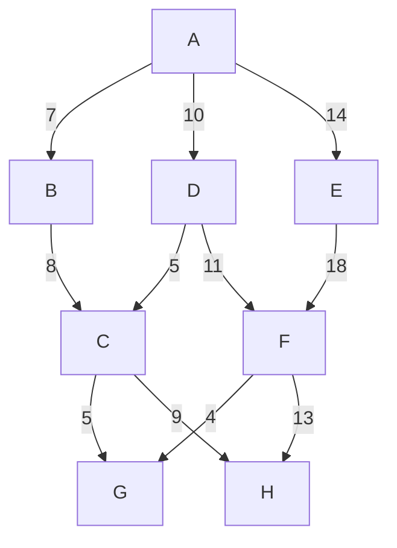

# Exercice 5

## Tableau de l'algorithme de Dijkstra

| Étape | Noeud actuel | Distance depuis A | Chemin |
|-------|---------------|-------------------|--------|
| 1     | A             | 0                 | A      |
| 2     | B             | 7                 | A -> B |
| 3     | D             | 10                | A -> D |
| 4     | C             | 15                | A -> D -> C |
| 5     | F             | 21                | A -> D -> F |
| 6     | G             | 25                | A -> D -> F -> G |
| 7     | H             | 24                | A -> D -> C -> H |

|
|-------|---------------|-------------------|--------|
|
|
|