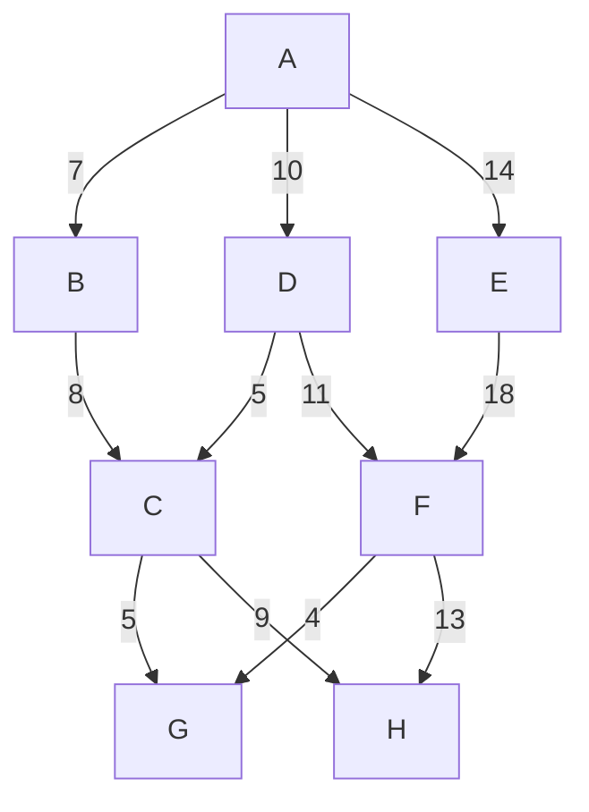

# Exercice 5

```mermaid
graph TD;
    A -- 7 --> B;
    B -- 8 --> C;
    A -- 10 --> D;
    A -- 14 --> E;
    E -- 18 --> F;
    D -- 5 --> C;
    D -- 11 --> F;
    F -- 4 --> G;
    C -- 5 --> G;
    C -- 9 --> H;
    F -- 13 --> H;
```
