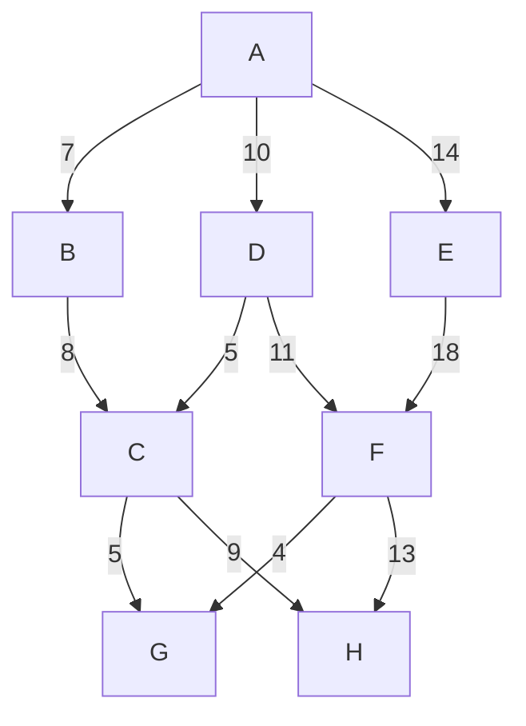
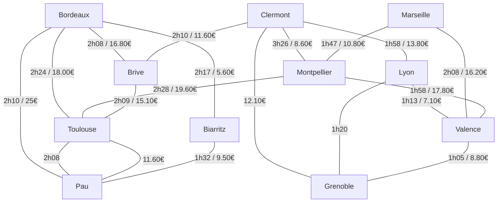

# Exercice 5

## Tableau de l'algorithme de Dijkstra

| Étape | Noeud actuel | Distance depuis A | Chemin |
|-------|---------------|-------------------|--------|
| 1     | A             | 0                 | A      |
| 2     | B             | 7                 | A -> B |
| 3     | D             | 10                | A -> D |
| 4     | C             | 15                | A -> D -> C |
| 5     | F             | 21                | A -> D -> F |
| 6     | G             | 25                | A -> D -> F -> G |
| 7     | H             | 24                | A -> D -> C -> H |

## EXERCICE 8 : Durée et coût de trajets autoroutiers

Le tableau ci-dessous donne les durées et coût (péage) des trajets autoroutiers entre les principales villes du Sud de la France :

|            | Bordeaux | Clermont | Lyon  | Marseille | Montpellier | Brive  | Toulouse | Valence | Biarritz | Pau   | Grenoble |
|------------|---------|----------|-------|-----------|-------------|--------|----------|---------|----------|--------|----------|
| **Numéro** | 1       | 6        | 9     | 8         | 7           | 4      | 5        | 10      | 2        | 3      | 11       |
| Bordeaux   | -       | -        | -     | -         | -           | 16.80  | 18.00 €  | -       | 5,60 €   | 25 €   | -        |
| Clermont   | -       | -        | 13.80 | -         | 8.60        | 11.60  | -        | -       | -        | -      | 12,10 €  |
| Lyon       | -       | 1h58     | -     | -         | -           | -      | -        | 7.10    | -        | -      | -        |
| Marseille  | -       | -        | -     | -         | 10.80       | -      | -        | 16.20   | -        | -      | -        |
| Montpellier| -       | 3h26     | -     | 1h47      | -           | -      | 19.60    | 17,80 € | -        | -      | -        |
| Brive      | 2h08    | 2h10     | -     | -         | -           | -      | 15.10    | -       | -        | -      | -        |
| Toulouse   | 2h24    | -        | -     | -         | 2h28        | 2h09   | -        | -       | -        | 11,60  | -        |
| Valence    | -       | -        | 1h13  | 2h08      | 1h58        | -      | -        | -       | -        | -      | 8,80 €   |
| Biarritz   | 2h17    | -        | -     | -         | -           | -      | -        | -       | -        | 9,50 € | -        |
| Pau        | 2h10    | -        | -     | -         | -           | -      | 2h08     | -       | 1h32     | -      | -        |
| Grenoble   | -       | -        | 1h20  | -         | -           | -      | -        | 1h05    | -        | -      | -        |

## Chemin le plus court en durée 🕒

| Étape        |   Départ    |   Arrivée  | Durée (min) | Durée cumulée |
|-------------|-------------|-------------|-------------|---------------|
| 1️⃣ | Grenoble    | Valence     | 65  | 65         |
| 2️⃣ | Valence     | Montpellier | 118 | 183        |
| 3️⃣ | Montpellier | Toulouse    | 148 | 331        |
| 4️⃣ | Toulouse    | Pau         | 128 | 459        |
| 5️⃣ | Pau         | Biarritz    | 92  | 551        |

## Chemin le moins cher 💰

| Étape        | Départ    | Arrivée   | Coût (€) | Coût cumulé (€) |
|-------------|----------|----------|---------|----------------|
| 1️⃣ | Grenoble  | Valence   | 8.80    | 8.80           |
| 2️⃣ | Valence   | Lyon      | 7.10    | 15.90          |
| 3️⃣ | Lyon      | Clermont  | 13.80   | 29.70          |
| 4️⃣ | Clermont  | Brive     | 11.60   | 41.30          |
| 5️⃣ | Brive     | Bordeaux  | 16.80   | 58.10          |
| 6️⃣ | Bordeaux  | Biarritz  | 5.60    | 63.70          |