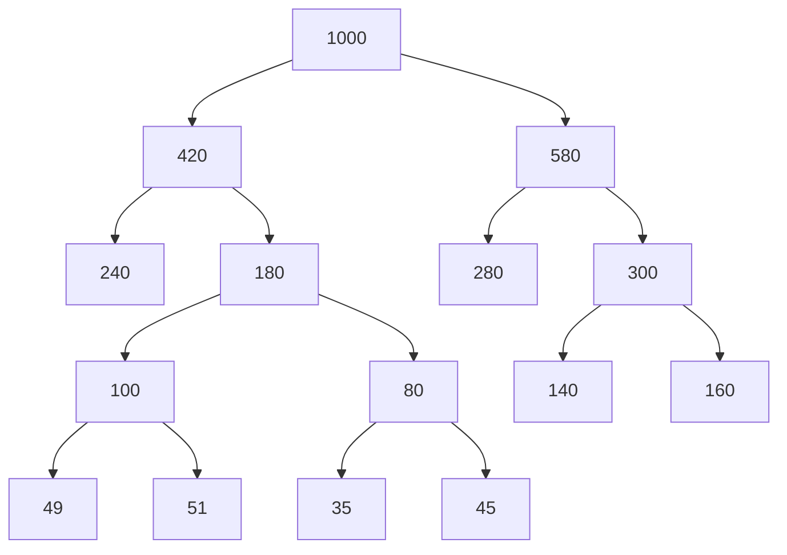

# Huffman

## Partie A

## 1. Coder chaque lettre de l'alphabet

a) **Nombre de bits nécessaires pour coder les 8 lettres de l'alphabet :**

Pour coder 8 lettres, on a besoin d'un nombre de bits tel que :

n = log_2(8) = 3
Donc, **3 bits** sont nécessaires pour coder chacune des 8 lettres de l'alphabet.

b) **Longueur en octets d’un message de 1 000 caractères :**

- Chaque caractère est codé sur 3 bits.
- Pour 1 000 caractères :
1 000 * 3 = 3 000  bits
- Conversion en octets :
3 000/8 = 375  octets

**-> 375 octets.**

---

## 2. Code de taille fixe pour chaque caractère

| Lettre | Code |
|--------|------|
| A      | 000  |
| B      | 001  |
| C      | 010  |
| D      | 011  |
| E      | 100  |
| F      | 101  |
| G      | 110  |
| H      | 111  |

---

## 3. Code préfixe

| Lettre | Code  |
|--------|-------|
| A      | 10    |
| B      | 001   |
| C      | 000   |
| D      | 1100  |
| E      | 01    |
| F      | 1101  |
| G      | 1110  |
| H      | 1111  |

a) Code du message "CACHE" :

- C : 000
- A : 10
- C : 000
- H : 1111
- E : 01

Le code est donc :
Réponse : 00010000111101

b)

- 001 : B
- 10 : A
- 1100 : D
- 01 : E
- 1101 : F

Le message est : **BADEF**

---

### 4. Longueur des messages en bits

a) Avec le code de taille fixe :

- Chaque caractère est codé sur 3 bits.
- Nombre total de caractères : 1 000.
- Longueur totale :
1 000 * 3 = 3 000  bits

Réponse : 3 000 bits.

b) Avec le code préfixe :

En utilisant les fréquences et les longueurs de codes :

| Lettre | Nombre | Code  | Longueur du code | Total bits |
|--------|--------|-------|------------------|------------|
| A      | 240    | 10    | 2                | 240 \* 2 = 480 |
| B      | 140    | 001   | 3                | 140 \* 3 = 420 |
| C      | 160    | 000   | 3                | 160 \* 3 = 480 |
| D      | 51     | 1100  | 4                | 51 \* 4 = 204  |
| E      | 280    | 01    | 2                | 280 \* 2 = 560 |
| F      | 49     | 1101  | 4                | 49 \* 4 = 196  |
| G      | 45     | 1110  | 4                | 45 \* 4 = 180  |
| H      | 35     | 1111  | 4                | 35 \* 4 = 140  |

Total :
480 + 420 + 480 + 204 + 560 + 196 + 180 + 140 = 2 660  bits
 2 660 bits.**

## Partie B

1.

