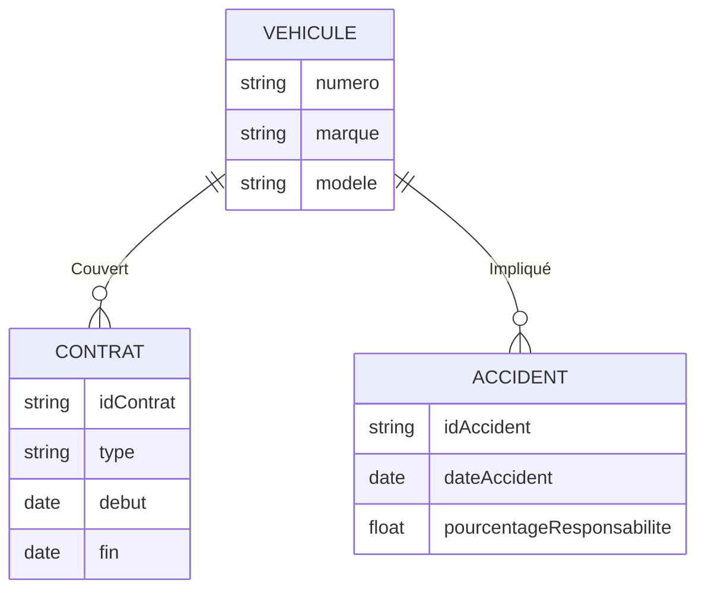
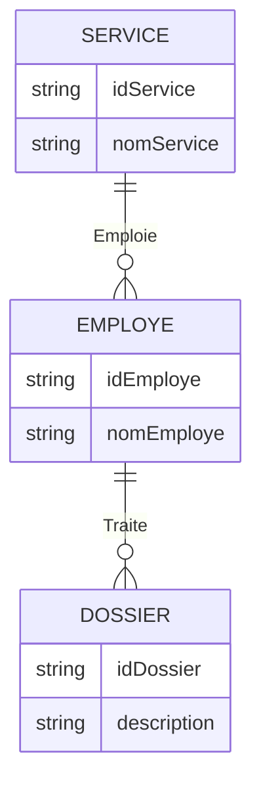
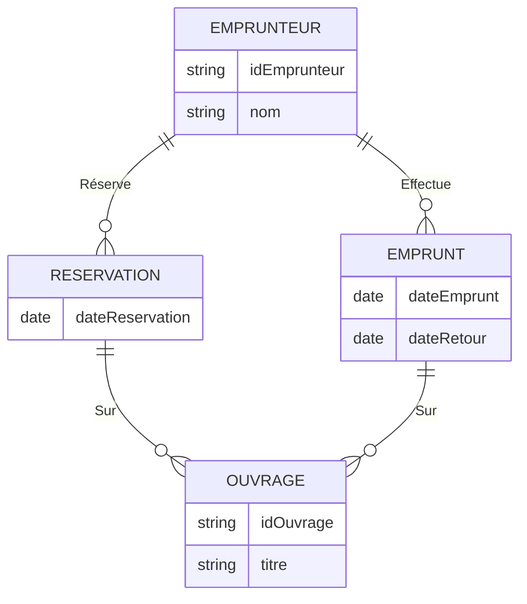
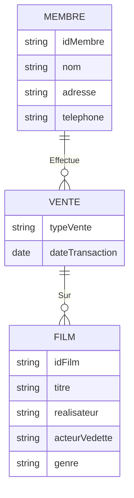
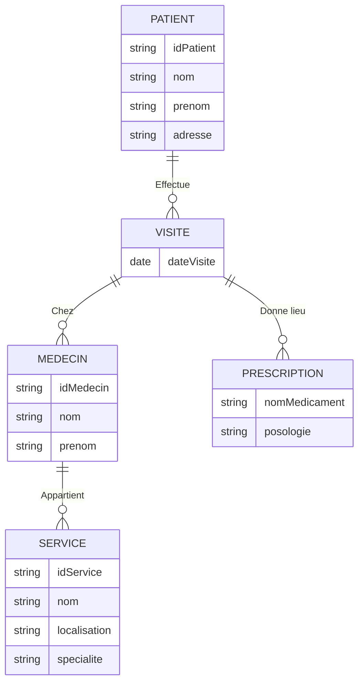
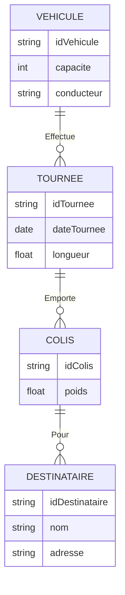
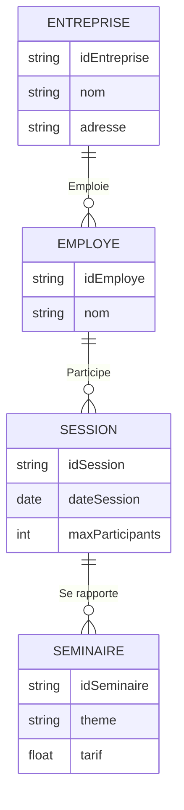

# Résolution des exercices de modélisation

## Exercice 1

### Modifier le schéma pour

1. Un véhicule peut être couvert par plusieurs contrats.
2. Associer à chaque véhicule impliqué dans un accident un pourcentage de responsabilité.

---

## Exercice 2

### Modifier le schéma pour préciser qu’un service traite un dossier si un de ses employés est en charge

---

## Exercice 3

### Représenter

1. La réservation d’un ouvrage par un emprunteur.
2. L’historique des emprunts d’ouvrages.

---

## Exercice 4

### Représenter une plateforme vidéo proposant des films en location ou achat

---

## Exercice 5

### Représenter les patients, visites, prescriptions dans un hôpital

---

## Exercice 6

### Représenter le fonctionnement d’une entreprise de distribution

---

## Exercice 7

### Représenter une société de formation

---

## Exercice 8

### Normaliser le schéma

1. **1NF :** Suppression des groupes de valeurs multiples.
2. **2NF :** Élimination des dépendances partielles.
3. **3NF :** Élimination des dépendances transitives.

---

## Exercice 9

### Construire le schéma des tables correspondant au concept

1. Définir chaque entité avec clé primaire.
2. Relier les entités via des clés étrangères selon les associations décrites.
