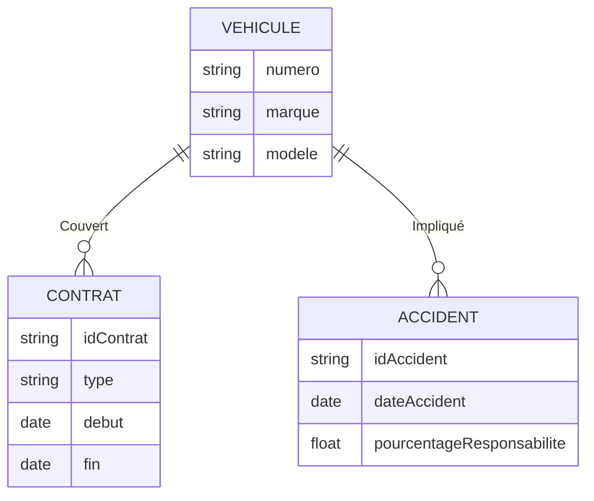
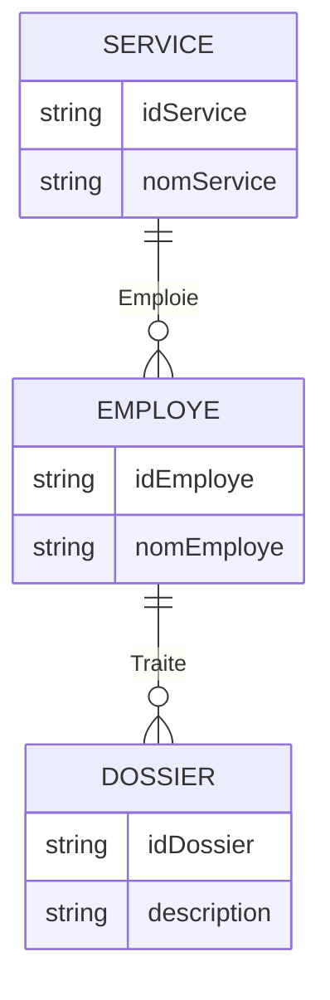
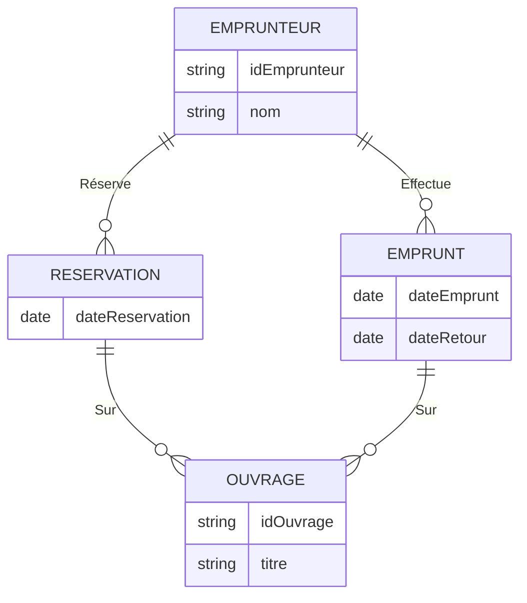
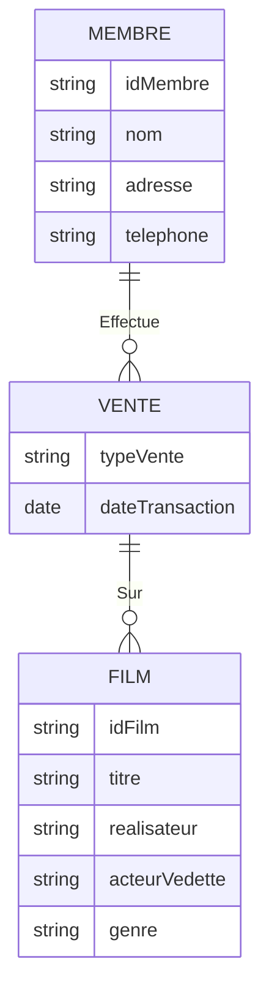
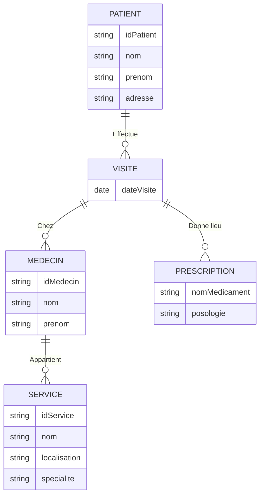
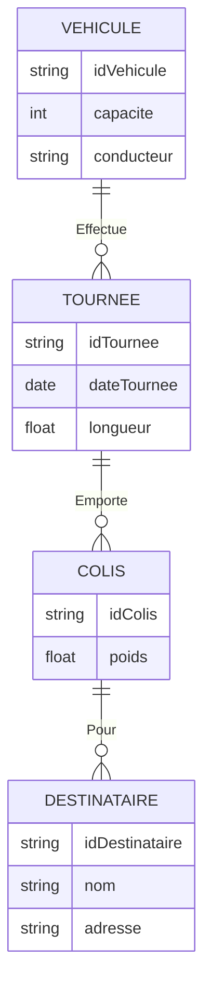
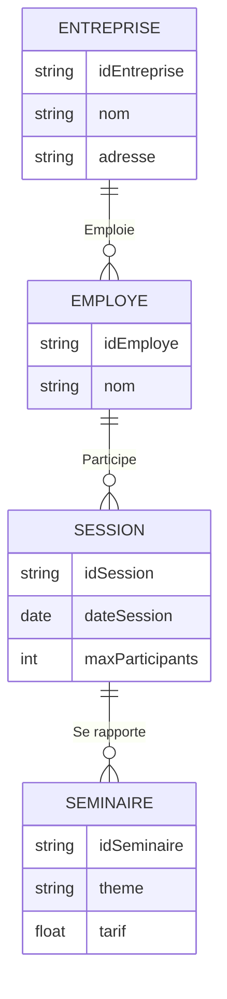
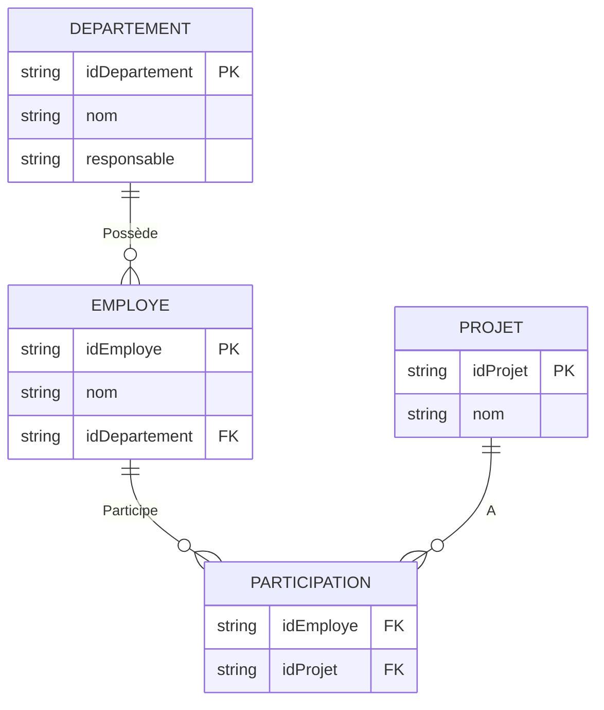

# Résolution des exercices de modélisation

## Exercice 1

### Modifier le schéma pour

1. Un véhicule peut être couvert par plusieurs contrats.
2. Associer à chaque véhicule impliqué dans un accident un pourcentage de responsabilité.

---

## Exercice 2

### Modifier le schéma pour préciser qu’un service traite un dossier si un de ses employés est en charge

---

## Exercice 3

### Représenter

1. La réservation d’un ouvrage par un emprunteur.
2. L’historique des emprunts d’ouvrages.

---

## Exercice 4

### Représenter une plateforme vidéo proposant des films en location ou achat

---

## Exercice 5

### Représenter les patients, visites, prescriptions dans un hôpital

---

## Exercice 6

### Représenter le fonctionnement d’une entreprise de distribution

---

## Exercice 7

### Représenter une société de formation

---

## Exercice 8

### Normaliser le schéma

**Schéma initial :**

- Table : **DEPARTEMENT**
  - Attributs : Entreprise, Adresse, Responsable, Téléphone.

**Dépendances fonctionnelles :**

1. **Entreprise → Adresse, Responsable**
2. **Responsable → Téléphone**

#### **Étapes de normalisation :**

1. **1NF (Première forme normale)** : Pas de groupes de valeurs multiples.
   - Les données sont déjà atomiques.

2. **2NF (Deuxième forme normale)** : Suppression des dépendances partielles.
   - Diviser la table en deux :
     - **Entreprise(Entreprise, Adresse, Responsable)**
     - **Responsable(Responsable, Téléphone)**

3. **3NF (Troisième forme normale)** : Suppression des dépendances transitives.
   - Chaque attribut dépend directement de la clé primaire.

**Schéma final :**

- **Table Entreprise** : Clé primaire : `Entreprise`.
  - Attributs : Adresse, Responsable.
- **Table Responsable** : Clé primaire : `Responsable`.
  - Attributs : Téléphone.

---

## Exercice 9

### Construire le schéma des tables correspondant au concept

**Structure administrative donnée :**

1. **Entités principales :**
   - **Département** : ID_Departement (clé primaire), Nom, Responsable.
   - **Employé** : ID_Employé (clé primaire), Nom, ID_Departement (clé étrangère).
   - **Projet** : ID_Projet (clé primaire), Nom.

2. **Relations :**
   - Un département a plusieurs employés.
   - Un employé peut participer à plusieurs projets.

**Schéma relationnel :**

- **Table Département** :
  - Attributs : ID_Departement (PK), Nom, Responsable.

- **Table Employé** :
  - Attributs : ID_Employé (PK), Nom, ID_Departement (FK).

- **Table Projet** :
  - Attributs : ID_Projet (PK), Nom.

- **Table Participation** :
  - Attributs : ID_Employé (FK), ID_Projet (FK).

